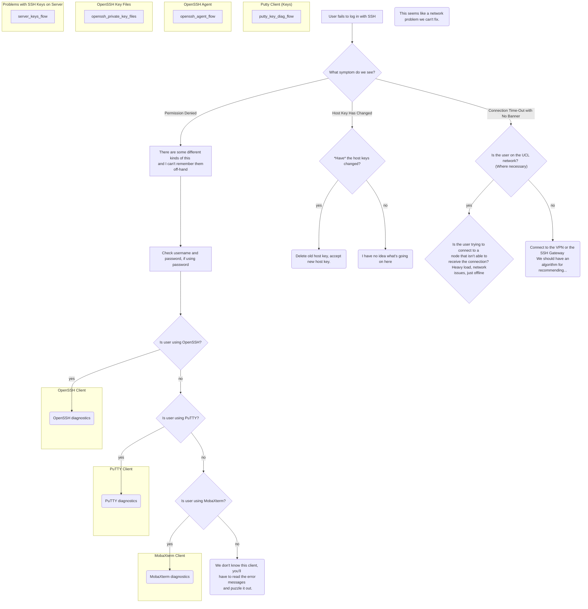

# mermaid-test

```mermaid
graph TD
  login_fail[User fails to log in with SSH]
  
  login_fail --> what_symptom
  what_symptom{What symptom do we see?}
  what_symptom -- Host Key Has Changed --> changed_hostkeys
  what_symptom -- Connection Time-Out with No Banner --> wrong_network
  what_symptom -- Permission Denied --> uhhhh[There are some different kinds of this \n and I can't remember them off-hand]
  
  uhhhh --> perm_denied

  changed_hostkeys{*Have* the host keys changed?}
  changed_hostkeys -- yes --> get_new_host_key(Delete old host key, accept new host key.)
  changed_hostkeys -- no  --> wtf(I have no idea what's going on here)

  wrong_network{"Is the user on the UCL network? \n (Where necessary)"}
  wrong_network -- yes --> node_unavailable_timeout{Is the user trying to connect to a \n node that isn't able to receive the connection? \n Heavy load, network issues, just offline}
  wrong_network -- no --> get_to_right_network(Connect to the VPN or the SSH Gateway \n We should have an algorithm for recommending...)

  
  network_problems_other(This seems like a network problem we can't fix.)
  
  perm_denied[Check username and password, if using password]
  perm_denied --> is_openssh
  
  is_openssh{Is user using OpenSSH?}
  is_openssh -- yes --> openssh_diag_flow(OpenSSH diagnostics)
  is_openssh -- no  --> is_putty{Is user using PuTTY?}
  
  is_putty   -- yes --> putty_diag_flow(PuTTY diagnostics)
  is_putty   -- no  --> is_mobaxterm{Is user using MobaXterm?}
  
  is_mobaxterm -- yes --> mobaxterm_diag_flow(MobaXterm diagnostics)
  is_mobaxterm -- no  --> what_client(We don't know this client, you'll \n have to read the error messages \n and puzzle it out.)
  
  subgraph putty_diag_graph[PuTTY Client]
    putty_diag_flow
  end
  
  subgraph putty_key_diag_graph["Putty Client (Keys)"]
    putty_key_diag_flow
  end
  
  subgraph openssh_diag_graph[OpenSSH Client]
    openssh_diag_flow
  end
  
  subgraph openssh_agent_problems[OpenSSH Agent]
    openssh_agent_flow
  end
  
  subgraph openssh_private_key_file_problems[OpenSSH Key Files]
    openssh_private_key_files
  end
  
  subgraph mobaxterm_diag_graph[MobaXterm Client]
    mobaxterm_diag_flow
  end
  
  subgraph authorized_key_problems[Problems with SSH Keys on Server]
    server_keys_flow
  end
```
